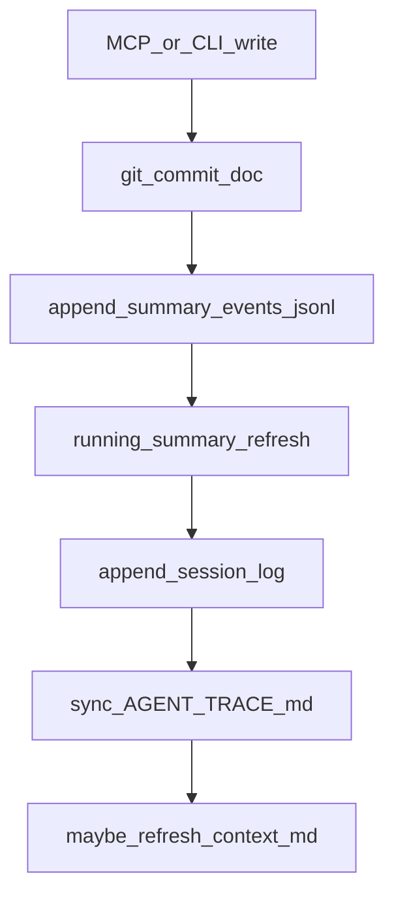
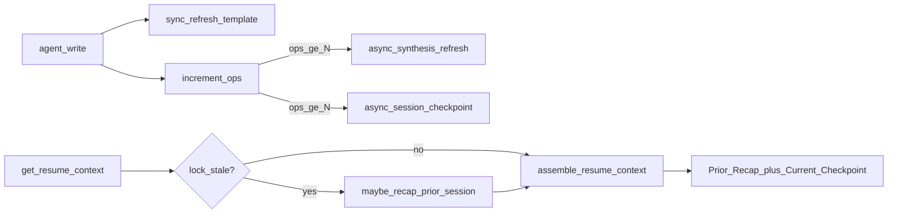

# Running Summary + Session Recap Fix Plan

**Repo:** [agent_trace](.) (Rust CLI, git-backed agent document store)  
**Branch:** `main` @ `42558c1` or later  
**Scope:** Two bugs in the trace/synthesis pipeline. No changes to TUI, MCP tool surface, or Cargo feature defaults.

---

## Part 1 — Problem Context (read this first)

### What Agent Trace does

Agent Trace tracks agent work (plans, progress notes, context) in a self-managed git repo under `.agent-trace/repo/`. When an agent writes documents via MCP `write_file` or CLI, a hook pipeline runs ([`src/trace/pipeline.rs`](src/trace/pipeline.rs) `apply_trace_hooks`):



Key artifacts for **cross-session resume**:

| Artifact | Path | Purpose |
|----------|------|---------|
| Event log | `.agent-trace/summary_events.jsonl` | Append-only record of every write |
| Running summary | `running_summary.md` | Human/agent-facing "where am I" doc |
| Session log | `logs/{agent}-{session_id}.md` | Per-change entries |
| Prior recap | `.agent-trace/session_recaps/{session_id}.md` | LLM narrative of ended session |
| Resume payload | MCP `get_resume_context` | Assembles all of the above |

**Synthesis backends** (configured via `agent-trace model setup`):

- Default: `mode = auto` → try remote APIs → **Ollama** → embedded Candle GGUF (`--features llm`) → degraded templates
- Ollama is the intended local path; embedded LLM is expensive fallback only
- Config: [`src/state/config.rs`](src/state/config.rs) `SynthesisConfig::refresh_every_ops` (default **10**)

---

### Bug A — `running_summary.md` lags behind writes (Issue 2)

**Symptom:** After MCP writes 1–9 times, `summary_events.jsonl` is current but `running_summary.md` still shows old "Recent Activity" and "Resume Here". Agents reading the summary or calling `get_resume_context` (without hitting the stale watermark) see stale state.

**Root cause** in [`src/trace/pipeline.rs`](src/trace/pipeline.rs) lines 209–214:

```rust
let summary_path = store_root.join("running_summary.md");
if summary_path.exists() {
    running_summary::schedule_refresh(store_root.to_path_buf());  // gated at N ops
} else if let Err(e) = running_summary::refresh_template(...) { ... }
```

Once `running_summary.md` exists, **only** `schedule_refresh()` is called. In [`src/trace/running_summary.rs`](src/trace/running_summary.rs) `schedule_refresh_inner` (lines 354–363), it **returns immediately** if `ops_since_refresh < refresh_every_ops` (default 10).

Both the **cheap template path** (`refresh_template` → `synthesize_template_summary`) and the **expensive synthesis path** (`refresh` → Ollama `update_running_summary`) are behind the same gate.

**Secondary trap:** `refresh_template` calls `save_events_watermark`, which resets `ops_since_refresh` to 0 (lines 113–117). Any future fix that naively calls `refresh_template` on every write **without** splitting state would prevent LLM batching from ever firing.

**Intended design (not implemented):**

| Trigger | Path | Cost |
|---------|------|------|
| Every agent write | Sync template refresh | Free (reads JSONL + plan.md) |
| Every N writes | Async synthesis refresh | Ollama HTTP call |

---

### Bug B — Session recap missing on reconnect (Issue 3)

**Symptom:** Agent interrupts work (Ctrl+C), reconnects within 30 minutes, calls `get_resume_context`, and gets no narrative of what happened — only raw plan text and possibly stale running summary. Live testing showed agents then re-read the entire codebase.

**What exists today:**

- `summarize_session` API works via Ollama/remote/embedded ([`src/llm/trace_insights.rs`](src/llm/trace_insights.rs))
- `maybe_recap_prior_session` in [`src/trace/session_recap.rs`](src/trace/session_recap.rs) generates `.agent-trace/session_recaps/{old_session_id}.md`
- **Only called from** [`src/runtime/session.rs`](src/runtime/session.rs):
  - `start_session()` when lock is stale (>30 min heartbeat)
  - `AgentState::current_actor()` when lock is stale

**Three failure modes:**

```mermaid
flowchart TD
    subgraph works [Works today]
        stale_restart[MCP_process_restarts_with_stale_lock]
        stale_restart --> current_actor[current_actor_sees_stale]
        current_actor --> recap[maybe_recap_prior_session]
        recap --> mc9[MC-9_passes]
    end

    subgraph broken1 [Bug: stale lock no restart]
        stale_no_restart[Long_running_MCP_or_CLI_resume]
        stale_no_restart --> get_resume[get_resume_context]
        get_resume --> no_recap[only_refresh_if_stale_no_recap]
    end

    subgraph broken2 [Bug: interrupt within 30 min]
        interrupt[Ctrl+C_same_session_id]
        interrupt --> reconnect[reconnect_within_30min]
        reconnect --> same_lock[same_session_id_continues]
        same_lock --> no_recap2[no_recap_trigger_ever]
    end
```



1. **Stale lock, no process restart:** `handle_get_resume_context` ([`src/adapters/mcp/server.rs`](src/adapters/mcp/server.rs) line 207) calls `refresh_if_stale` but never `maybe_recap_prior_session`. Stale lock remains; no recap file created unless MCP restarts.

2. **Interrupt within 30 minutes:** Session lock is still fresh (`STALE_TIMEOUT_MINUTES = 30` in [`src/runtime/session.rs`](src/runtime/session.rs)). Same `session_id`, same log file — `maybe_recap_prior_session` never runs because there is no "prior" session. `load_prior_session_recap` explicitly excludes the **current** non-stale session.

3. **No mid-session checkpoints:** Nothing calls `summarize_session` during an active session at the N-op threshold. The agent gets per-change log lines (`+12 lines`) but no rolling narrative checkpoint.

**This is a product bug**, not a missing feature polish: `get_resume_context` is documented as the first call on reconnect ([`README.md`](README.md), MCP `initialize` instructions), but it does not guarantee a usable narrative bridge.

---

## Part 2 — High-Level Solution

### Bug A fix — Split template and synthesis refresh

1. **Every write:** sync `refresh_template()` — update `running_summary.md` from JSONL + plan (no Ollama).
2. **Every N writes:** async `schedule_synthesis_refresh()` — Ollama `update_running_summary`, reset op counter.
3. **Split `SummaryState` watermarks** so template refresh does not reset the synthesis op counter.

### Bug B fix — Recap on demand + mid-session checkpoints

1. **`get_resume_context`:** if lock is stale → `maybe_recap_prior_session` before assembly.
2. **At N-op threshold (shared with synthesis):** generate a **session checkpoint** for the **current** session via `summarize_session`, persist to `.agent-trace/session_checkpoints/{session_id}.md`.
3. **`assemble_resume_context`:** add `## Current Session Checkpoint` section (current session) alongside existing `## Prior Session Recap` (ended sessions).



---

## Part 3 — Implementation (In Depth)

### Workstream A — Split summary state and refresh paths

**Owner:** Can start immediately. Touches [`src/trace/running_summary.rs`](src/trace/running_summary.rs) + [`src/trace/pipeline.rs`](src/trace/pipeline.rs).

#### A1. Extend `SummaryState`

File: [`src/trace/running_summary.rs`](src/trace/running_summary.rs)

Current:
```rust
pub struct SummaryState {
    pub events_count_at_refresh: usize,
    pub ops_since_refresh: usize,
}
```

Change to (keep serde defaults for backward compat):
```rust
pub struct SummaryState {
  #[serde(default)]
  pub events_count_at_template_refresh: usize,
  #[serde(default)]
  pub events_count_at_synthesis_refresh: usize,
  #[serde(default)]
  pub ops_since_synthesis: usize,
  // Deprecated fields — migrate on load:
  // if old file has events_count_at_refresh, copy to both watermarks
}
```

Add `migrate_summary_state()` in `load_summary_state` to map legacy `events_count_at_refresh` / `ops_since_refresh` if new fields are zero.

#### A2. Split watermark helpers

- `save_template_watermark(store_root, event_count)` — updates `events_count_at_template_refresh` only; **does not** reset `ops_since_synthesis`
- `save_synthesis_watermark(store_root, event_count)` — updates `events_count_at_synthesis_refresh` and resets `ops_since_synthesis` to 0
- `increment_ops` → rename to `increment_synthesis_ops` (increment `ops_since_synthesis`)

#### A3. Update `refresh_template`

- Call `save_template_watermark` instead of `save_events_watermark`
- No LLM, no op-counter reset

#### A4. Update `refresh` (synthesis path)

- Call `save_synthesis_watermark` on success
- Keep existing Ollama `update_running_summary` + template fallback

#### A5. Rename and narrow `schedule_refresh`

- `schedule_synthesis_refresh(store_root)` — only spawns when `ops_since_synthesis >= refresh_every_ops`
- Background thread calls `refresh()` (synthesis), not `refresh_template`

#### A6. Update `refresh_if_stale`

Split into two concerns used by `get_resume_context`:
- Template is already fresh (every write) — **remove** full `refresh_from_path` for template staleness, or keep as safety bootstrap only when file missing
- `refresh_synthesis_if_stale` — if `ops_since_synthesis > 0` OR `event_count > events_count_at_synthesis_refresh`, call `schedule_synthesis_refresh` and optionally `wait_refresh_idle` (test-only) or block briefly

Recommended `get_resume_context` behavior: call sync `refresh_template` if events > template watermark (cheap safety), then `schedule_synthesis_refresh` if synthesis behind (async, non-blocking).

#### A7. Update `apply_trace_hooks` in pipeline

Replace lines 209–214 with:
```rust
// Always sync template (cheap)
if let Err(e) = running_summary::refresh_template(store_root, git, manifest) {
    tracing::warn!("running summary template refresh failed: {e}");
}
// Async synthesis at N-op threshold
running_summary::schedule_synthesis_refresh(store_root.to_path_buf());
```

#### A8. Unit tests (running_summary.rs)

- `template_refresh_every_write_does_not_reset_synthesis_ops` — append 3 events, call template refresh each time, assert `ops_since_synthesis == 3`
- `synthesis_refresh_resets_ops_at_threshold` — append 10 events, run synthesis refresh, assert ops reset
- Update existing `refresh_if_stale_*` and `schedule_refresh_*` tests for new field names

---

### Workstream B — Session recap bug fix

**Owner:** Can start in parallel with A. Touches [`src/trace/session_recap.rs`](src/trace/session_recap.rs), [`src/adapters/mcp/server.rs`](src/adapters/mcp/server.rs), [`src/commands/resume.rs`](src/commands/resume.rs) if exists.

#### B1. Add `ensure_prior_session_recap(store_root) -> Result<Option<String>>`

In [`src/trace/session_recap.rs`](src/trace/session_recap.rs):

```rust
pub fn ensure_prior_session_recap(store_root: &Path) -> Result<()> {
    if let Some(sess) = crate::session::load_session(store_root) {
        if sess.is_stale() {
            maybe_recap_prior_session(store_root, &sess)?;
        }
    }
    Ok(())
}
```

Do **not** remove the stale lock here — leave session lifecycle to `start_session` / `current_actor`. Recap generation is read-only with respect to the lock.

#### B2. Call from `handle_get_resume_context`

In [`src/adapters/mcp/server.rs`](src/adapters/mcp/server.rs) `handle_get_resume_context`, **before** `refresh_if_stale`:

```rust
if let Err(e) = session_recap::ensure_prior_session_recap(root) {
    tracing::warn!("prior session recap failed: {e}");
}
```

#### B3. Call from CLI `resume show` / `resume refresh`

Mirror the same call in [`src/commands/resume.rs`](src/commands/resume.rs) so CLI-only workflows get the fix.

#### B4. E2E test MC-10

Add to [`tests/e2e_agent_connection.rs`](tests/e2e_agent_connection.rs):

**`mc10_stale_recap_without_mcp_restart`:** Write via MCP, stale the lock file, call `get_resume_context` on a **single** long-lived harness (do not create second `McpHarness` — use raw JSON-RPC on same process if harness supports it, or add a harness method that sends one tool call without re-init). Assert recap file exists and response contains "Prior Session Recap".

If harness always re-inits MCP, test via CLI: `agent-trace resume show` after staling lock without `connect`.

---

### Workstream C — Mid-session checkpoints

**Owner:** Start after A1–A5 land (shares op counter and synthesis threshold). Touches new checkpoint module + `assemble_resume_context`.

#### C1. New module `src/trace/session_checkpoint.rs`

```rust
const CHECKPOINTS_DIR: &str = ".agent-trace/session_checkpoints";

pub fn checkpoint_path(store_root: &Path, session_id: &str) -> PathBuf { ... }

pub fn generate_session_checkpoint(store_root: &Path, session: &AgentSession) -> Result<String>
// Same pattern as generate_session_recap but for CURRENT session events
// Uses summarize_session via TraceInsightsFacade, template fallback if degraded

pub fn maybe_write_session_checkpoint(store_root: &Path, session_id: &str) -> Result<()>
// Load session from lock, verify session_id matches, generate + persist (overwrite file)
```

Reuse event loading from [`session_recap.rs`](src/trace/session_recap.rs) `load_events_for_session`.

#### C2. Trigger at synthesis threshold

In `schedule_synthesis_refresh` background thread, **after** successful `refresh()`:

```rust
if let Some(sid) = session::session_id_for_store(&store_root) {
    let _ = session_checkpoint::maybe_write_session_checkpoint(&store_root, &sid);
}
```

Use the same `refresh_every_ops` threshold — one Ollama batch can produce both updated running summary and checkpoint (two API calls; acceptable at N=10).

#### C3. Expose in `assemble_resume_context`

In [`src/trace/running_summary.rs`](src/trace/running_summary.rs) `assemble_resume_context`, after SESSION block:

```rust
if let Some(sess) = session::load_session(store_root).filter(|s| !s.is_stale()) {
    if let Some(cp) = session_checkpoint::load_checkpoint(store_root, &sess.session_id) {
        out.push_str("## Current Session Checkpoint\n\n");
        out.push_str(&cp);
        out.push_str("\n\n");
    }
}
```

#### C4. Unit tests

- `session_checkpoint.rs`: template checkpoint from events, persist/load roundtrip
- `assemble_resume_context_includes_current_checkpoint` in running_summary tests

#### C5. E2E test MC-11 (or extend MC-8)

Write 10+ times via MCP, assert `.agent-trace/session_checkpoints/{session_id}.md` exists and `get_resume_context` contains "Current Session Checkpoint".

---

### Workstream D — Docs and validation (after A+B+C)

**Owner:** Final pass, depends on all streams.

- [`CHANGELOG.md`](CHANGELOG.md) — under `[Unreleased]`: split template/synthesis refresh; recap on stale `get_resume_context`; session checkpoints
- [`docs/MODEL-SETUP.md`](docs/MODEL-SETUP.md) — note template updates every write, Ollama synthesis every N ops
- [`docs/VALIDATION-PLAN.md`](docs/VALIDATION-PLAN.md) — add MC-10, MC-11; document interrupt-within-30min test scenario
- Run `cargo test --locked` (full suite)

---

## Part 4 — Parallel Execution Guide

```mermaid
gantt
    title Workstreams
    dateFormat X
    axisFormat %s

    section A_SummarySplit
    A1_A8_running_summary_pipeline :a1, 0, 3
    section B_RecapBug
    B1_B4_stale_recap_on_resume :b1, 0, 2
    section C_Checkpoints
    C1_C5_mid_session_checkpoint :c1, 2, 3
    section D_Docs
    D_docs_changelog :d1, 5, 1
```



| Stream | Files | Depends on | Can parallelize with |
|--------|-------|------------|----------------------|
| **A** | `running_summary.rs`, `pipeline.rs` | — | B |
| **B** | `session_recap.rs`, `mcp/server.rs`, `commands/resume.rs`, e2e | — | A |
| **C** | `session_checkpoint.rs` (new), `running_summary.rs`, `mod.rs` | A5 (op counter API stable) | — |
| **D** | CHANGELOG, docs | A+B+C | — |

**Merge order:** A → C → B (B is independent but touch `running_summary.rs` only in assemble — coordinate if both edit `assemble_resume_context`).

---

## Part 5 — Acceptance Criteria

### Bug A
- [ ] After 1 MCP write, `running_summary.md` "Recent Activity" includes that write
- [ ] After 1–9 writes, `ops_since_synthesis` increments; Ollama not called
- [ ] After 10th write, background synthesis runs; `ops_since_synthesis` resets
- [ ] `summary_events.jsonl` unchanged behavior

### Bug B
- [ ] Stale lock + `get_resume_context` (no MCP restart) creates recap file and returns "Prior Session Recap"
- [ ] Fresh session interrupt: after 10 writes + reconnect within 30 min, `get_resume_context` includes "Current Session Checkpoint" with narrative or template fallback
- [ ] `maybe_recap_prior_session` still only runs once per session_id (idempotent)
- [ ] All existing tests pass (MC-7, MC-8, MC-9)

### Non-goals (do not implement in this PR)
- TUI changes
- `default = ["llm"]` in Cargo.toml
- Code file tracking (`.py`, `.html`)
- Cross-process `ui_events.jsonl`

---

## Part 6 — Key File Reference

| File | Role |
|------|------|
| [`src/trace/pipeline.rs`](src/trace/pipeline.rs) | `apply_trace_hooks` — change summary refresh calls here |
| [`src/trace/running_summary.rs`](src/trace/running_summary.rs) | State, template/synthesis split, `assemble_resume_context` |
| [`src/trace/session_recap.rs`](src/trace/session_recap.rs) | Prior session recap (stale sessions) |
| [`src/trace/session_checkpoint.rs`](src/trace/session_checkpoint.rs) | **New** — current session checkpoint |
| [`src/adapters/mcp/server.rs`](src/adapters/mcp/server.rs) | `handle_get_resume_context` |
| [`src/runtime/session.rs`](src/runtime/session.rs) | Lock file, stale timeout (30 min) |
| [`src/state/config.rs`](src/state/config.rs) | `refresh_every_ops` (default 10) |
| [`tests/e2e_agent_connection.rs`](tests/e2e_agent_connection.rs) | MC-7..11 |
